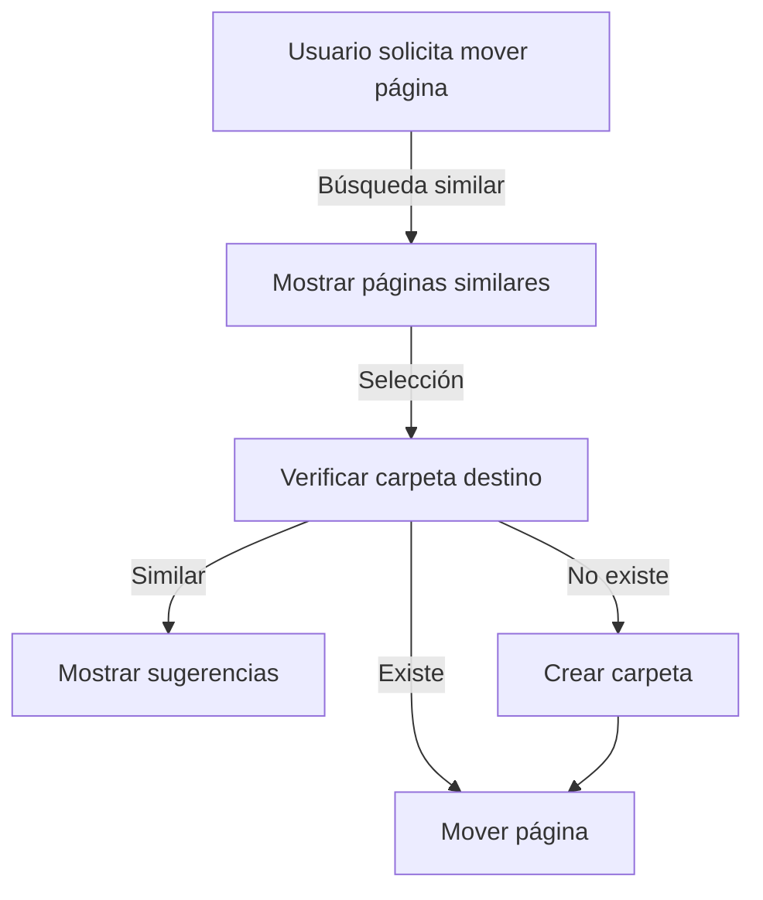
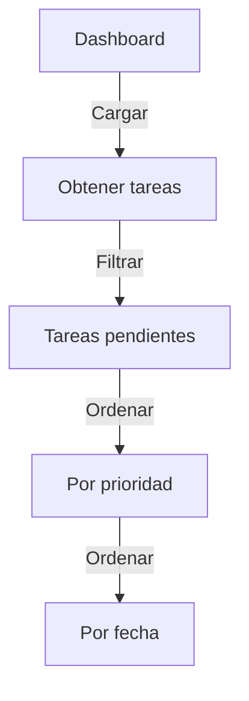

# Documentary

Una aplicación moderna de gestión de documentos y tareas, inspirada en Notion.

## Descripción del Proyecto
Documentary T. es una aplicación de documentación inspirada en Notion que combina un editor de texto enriquecido con un asistente virtual inteligente. El proyecto está construido con React y TypeScript para el frontend, utilizando una arquitectura de servicios modular y una base de datos SQLite para el almacenamiento.

## Características Principales
- Editor de texto enriquecido basado en BlockNote
- Sistema jerárquico de páginas y carpetas
- Asistente virtual inteligente con Gemini
- Gestión de tareas con prioridades y fechas
- Interfaz moderna con Material-UI
- Sistema de búsqueda inteligente

## Estructura del Proyecto
```
notion2/
├── src/
│   ├── components/
│   │   ├── AISearch.tsx         # Componente del chat asistente
│   │   ├── Dashboard.tsx        # Vista principal con tareas y páginas recientes
│   │   └── Editor/             # Componentes del editor
│   ├── services/
│   │   ├── geminiService.ts    # Lógica del asistente virtual
│   │   ├── storageService.ts   # Manejo de páginas y carpetas
│   │   └── taskService.ts      # Gestión de tareas
│   └── types/
│       └── index.ts            # Definiciones de tipos
```

## Componentes Principales

### Dashboard (`src/components/Dashboard.tsx`)
- Muestra páginas recientes y tareas próximas
- Implementa ordenamiento de tareas por prioridad y fecha
- Utiliza Material-UI para la interfaz

### AISearch (`src/components/AISearch.tsx`)
- Implementa el chat con el asistente virtual
- Maneja el auto-scroll para nuevos mensajes
- Procesa comandos en lenguaje natural

## Servicios

### geminiService (`src/services/geminiService.ts`)
Maneja la lógica del asistente virtual con las siguientes capacidades:

1. **Procesamiento de Comandos**
```typescript
interface LastAction {
  type: string | null;
  details: any;
  confirmed: boolean;
  suggestions?: Page[];
  folderSuggestions?: Folder[];
  createFolder?: boolean;
  selectedPage?: Page;
}
```

2. **Algoritmos de Búsqueda**
```typescript
const findSimilarPages = (pages: Page[], searchTitle: string, threshold: number = 0.35): Page[] => {
  // Implementación de búsqueda con similitud
}

const findSimilarFolders = (folders: Folder[], searchName: string, threshold: number = 0.4): Folder[] => {
  // Implementación de búsqueda para carpetas
}
```

### storageService (`src/services/storageService.ts`)
Gestiona el almacenamiento y manipulación de páginas y carpetas:

```typescript
interface StorageService {
  getPages(): Promise<Page[]>;
  getFolders(): Promise<Folder[]>;
  createFolder(name: string): Promise<Folder>;
  updatePage(id: string, updates: Partial<Page>): Promise<void>;
}
```

### taskService (`src/services/taskService.ts`)
Maneja la gestión de tareas:

```typescript
interface Task {
  id: string;
  title: string;
  description?: string;
  due_date?: string;
  priority: 'high' | 'medium' | 'low';
  status: 'pending' | 'completed';
}
```

## Flujos de Trabajo Principales

### 1. Movimiento de Páginas


### 2. Gestión de Tareas


## Últimas Actualizaciones

### Mejoras en el Dashboard
- Implementación de una sección de tareas próximas
- Ordenamiento de tareas por prioridad y fecha
- Auto-scroll en el chat para mejor experiencia de usuario

### Mejoras en el Asistente Virtual
- Capacidad mejorada para mover páginas entre carpetas
- Búsqueda inteligente de páginas y carpetas similares
- Creación automática de carpetas cuando no existen

## Desafíos y Soluciones

### 1. Búsqueda de Páginas Similares
**Problema:** La búsqueda inicial de páginas similares era demasiado estricta o demasiado flexible.

**Solución:**
- Algoritmo de similitud mejorado:
```typescript
similarity = (matchedWords + (partialMatches * 0.5)) / searchWords.length;
if (unmatchedPageWords > searchWords.length) {
  similarity *= 0.5;
}
```

### 2. Manejo de Carpetas
**Problema:** Gestión incorrecta de carpetas nuevas y movimiento de páginas.

**Solución:**
- Flujo de tres pasos con manejo de estado:
```typescript
interface LastAction {
  type: 'MOVE_PAGE' | 'CREATE_FOLDER' | null;
  details: {
    pageId?: string;
    pageTitle?: string;
    folderId?: string;
    folderName: string;
  };
  confirmed: boolean;
}
```

## Comandos del Asistente

### Mover Páginas
```
Mueve la página "Título de la Página" a la carpeta "Nombre de la Carpeta"
```

### Ver Tareas
```
¿Cuáles son mis tareas pendientes?
Muéstrame las tareas próximas
```

## Dependencias Principales
```json
{
  "@emotion/react": "^11.x",
  "@mui/material": "^5.x",
  "@google/generative-ai": "^0.1.x",
  "react": "^18.x",
  "typescript": "^4.x"
}
```

## Variables de Entorno Requeridas
```env
VITE_GEMINI_API_KEY=tu_api_key_aquí
```

## Próximas Mejoras Planificadas
- [ ] Mejorar la detección de fechas en lenguaje natural
- [ ] Implementar búsqueda por etiquetas
- [ ] Añadir filtros avanzados para tareas
- [ ] Mejorar la sugerencia de contenido relacionado

## Contribución
1. Fork del repositorio
2. Crear rama de feature (`git checkout -b feature/AmazingFeature`)
3. Commit de cambios (`git commit -m 'Add some AmazingFeature'`)
4. Push a la rama (`git push origin feature/AmazingFeature`)
5. Abrir un Pull Request

## Licencia
Este proyecto está bajo la licencia MIT. 